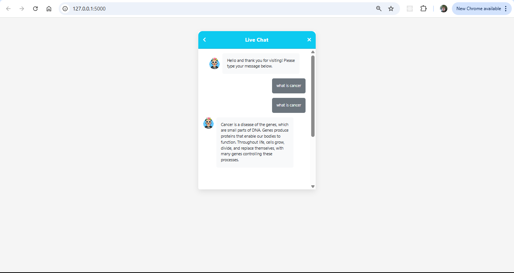
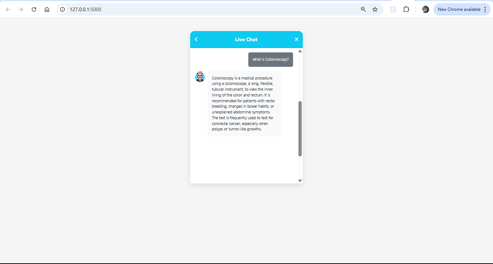

# Chatbot-Generative-Ai

# How to run
##STEPS

Clone the repository

```bash
Project repo: https://github.com/SheikhJack/Chatbot-Generative-Ai.git
```
### STEP 01- Create a virtual environment after opening the repo

```bash
python -m venv medibot
```

```bash
source medibot\Scripts\activate
```

### STEP 02- Install the requirements

```bash 
pip install -r requirements.txt


### Create a `.env` file in the root directory and add your credentials as follows

```ini
PINECONE_API_KEY = 'xxxxxxxxxxxxxxxxxxxxx'
GEMINI_API_KEY = 'xxxxxxxxxxxxxxxxxxxxx'
```

```bash
# run the following command to store embeddings to pinecone
python store_index.py
```


### STEP 03- Finally run the following command

```bash

python app.py
```

# example images 




